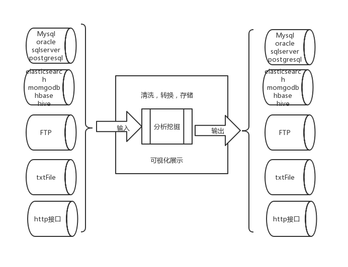
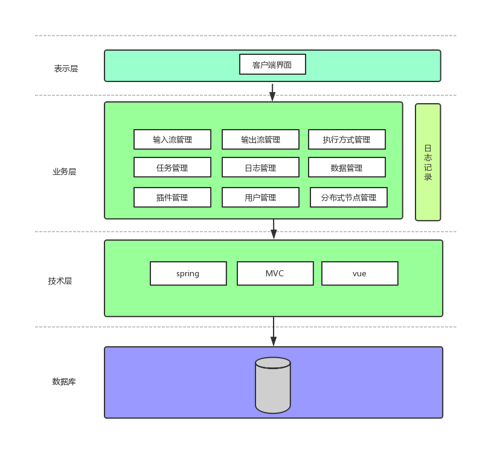

# 软件需求规格说明书
项目 | 项目名称| 
-|-|
文档 | 软件需求规格说明书 | 
文档ID |  | 
说明 | v1.0.0 |
作者 | jiangyuanlin|
最后更新时间 | 2019-06-12 

# 版本更新概要
版本号 | 时间 | 更新人 | 更新摘要 |
-|-|-|-|
v1.0.0 | 2019-06-12 | jiangyuanlin | 数据交换平台基本需求

# 项目负责人审核与确认
角色 | 姓名 | 职位 | 审核时间 | 审核意见（签字）|
-|-|-|-|-|
供应商 |jiangyuanlin | | | |
供应商 | | | | |
客户方 | | | | |
客户方 | | | | |

# 引言
## 编写目的
为明确软件需求、安排项目规划与进度、组织软件开发与测试，撰写本文档。
## 软件需求分析理论
软件需求分析（Software Reguirement Analysis）是研究用户需求得到的东西，完全理解用户对软件需求的完整功能，确认用户软件功能需求，建立可确认的、可验证的一个基本依据。
软件需求分析（Software Reguirement Analysis）是研究用户需求得到的东西，完全理解用户对软件需求的完整功能，确认用户软件功能需求，建立可确认的、可验证的一个基本依据。

## 软件需求分析目标
软件需求分析的主要实现目标： 
* 对实现软件的功能做全面的描述，帮助用户判断实现功能的正确性、一致性和完整性，促使用户在软件设计启动之前周密地、全面地思考软件需求；
* 了解和描述软件实现所需的全部信息，为软件设计、确认和验证提供一个基准；
* 了解和描述软件实现所需的全部信息，为软件设计、确认和验证提供一个基准；
需求分析的具体内容可以归纳为六个方面：软件的功能需求，软件与硬件或其他外部系统接口，软件的非功能性需求，软件的反向需求，软件设计和实现上的限制，阅读支持信息。
软件需求分析应尽量提供软件实现功能需求的全部信息，使得软件设计人员和软件测试人员不再需要需求方的接触。这就要求软件需求分析内容应正确、完整、一致和可验证。此外，为保证软件设计质量，便于软件功能的休整和验证，软件需求表达无岔意性，具有可追踪性和可修改性。

## 参考文献

# 需求概述
## 项目背景
   ​	电子政务通过应用现代信息和通信技术，实现了管理和服务的有机结合，成为当代信息化的最重要的领域之一。各级政府及其部门通过电子政务平台实现组织结构和工作流程的优化重组，超越部门之间的分隔限制，向社会提供优质和全方位的、规范而透明的管理和服务。   
因此，各级政府及其部门纷纷构建自己的电子政务业务系统，在其运行过程中收集的电子政务业务系统，在这些业务系统的运行过程中收集并形成了大量的信息并形成了信息资源。为了加强政务公开，实现更好地为公众提供服务，需要加强部门间的信息的交流与共享,加强政务信息和政务服务的公开。
## 需求概述
   政府各部门电子政务平台的信息格式和交换方式的不一致，造成了政府各部门间难以形成有效的信息的交换和共享，政府各部门间电子政务平台成为了信息孤岛，影响了政府各部门间工作协同的实现，更达不到政务信息和政务服务的公开的目的。例如，在工程建设领域，由于各个地方之间的项目信息和信用信息的不共享，造成无法对工程建设领域的违规责任者进行全国联动监管，在工程项目审批和招投标的时候无法对此违规企业进行市场准入的限制，该企业仍可在其他地方继续进行投标甚至中标，并继续建设施工质量问题的工程，最终造成多起安全事故。
可见，信息的交换和共享对于电子政务平台整体的应用效果起着至关重要的作用，信息的交换和共享的范围和有效性是电子政务平台的发展核心的推动力量。
数据交换组件目的是准确易用安全可靠的进行系统间数据交换。存储，清洗，挖掘，共享，以实现政府各部门间协同工作和政务信息和政务服务公开。
数据交换组件要避免操作流程过于复杂，导致用户使用成本过高。
  	。
## 条件与限制

### 假设
用户熟悉常见关系型数据库，nosql数据库，http协议以及交换数据双方的格式
### 依赖
spring,datax,jenkins,mysql,tomcat

## 业务环境

### 利益相关人
#### 大数据开发人员
需要在各环境（开发测试准生产）进行数据同步，需要对各业务系统进行数据抽取清洗传输
#### 运维人员
系统运行时需要对数据进行冗余或容灾备份，系统上线或升级时需要对新旧系统进行数据割接

### 项目优先级
#### 动机
解决数据格式不一致，数据交换繁琐复杂的问题
#### 约束
采用http协议浏览器可视化运行
#### 自由度
平台界面、交互方式

### 部署考虑
 用户通过PC浏览器形式访问到本组件。

## 概念模型图

## 系统结构图

## 网络拓扑图

# 系统功能需求
 
## 主要模块
 输入流管理，输出流管理，任务管理，执行方式管理，历史日志管理，数据管理，用户管理,角色管理，权限管理，分布式调度管理
   

## 第一期发布的范围

* 输入流的新建，编辑，删除，查看，搜索，选择，校验，包括但不限于MySQL，     	Oracle ，SQLServer，PostgreSQL，Hbase0.94，Hbase1.1，
MongoDB	，Hive，TxtFile，FTP，HDFS，Elasticsearch，HTTP接口
* 输出流的新建，编辑，删除，查看，搜索，选择，校验，包括但不限于MySQL，     	Oracle ，SQLServer，PostgreSQL，Hbase0.94，Hbase1.1，
MongoDB	，Hive，TxtFile，FTP，HDFS，Elasticsearch，HTTP接口
* 数据交换任务的新建，编辑，删除，查看，搜索，停止，开启
* 执行方式（手动立即，定时循环，条件触发）的新建，编辑，删除，查看，搜索
* 取消构建中的任务，构建历史启动时间查询，执行时长查询，构建日志删除

# 第二期发布的范围
* 数据存储，清洗，挖掘，订阅，搜索
* 用户新建，编辑,删除，查看，搜索，登录，退出
* 角色新建，编辑，删除，查看，搜索
* 权限新建，编辑，删除，查看，搜索
* master-slave模式设置,slave新建，编辑，删除，查看，搜索

## 限制和不包括的内容
不包括用户注册登录功能

